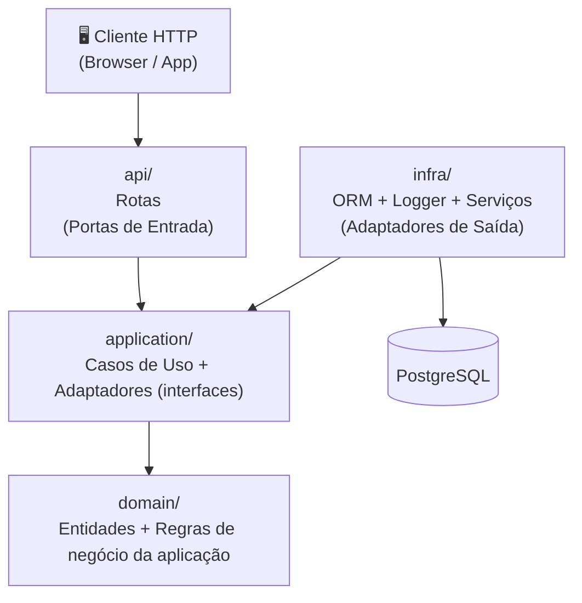
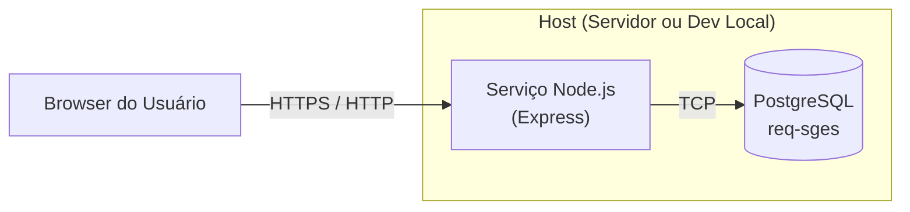

# Arquitetura do Produto

## 1. Introdução

Este módulo fala sobre a Arquitetura utilizada no projeto do SGES conforme definido pelo processo OpenUP. Seu objetivo é registrar as principais decisões arquiteturais, descrever os componentes do sistema, suas responsabilidades e restrições, e demonstrar como a arquitetura responde aos requisitos priorizados.

O documento serve de referência para a fase de Elaboração, onde a validação da arquitetura é critério de conclusão do marco de *Baseline da Arquitetura*.

---

## 2. Visão Geral da Arquitetura

O SGES adota o padrão **Arquitetura Hexagonal (Ports & Adapters)**, que isola o núcleo de regras de negócio de todos os mecanismos externos (banco de dados, HTTP, logs). Isso garante alta testabilidade, manutenibilidade e extensibilidade — qualidades essenciais em um sistema mantido por equipes voluntárias rotativas (ver RNF07).

### 2.1 Diagrama de Camadas

### 2.2 Stack Tecnológica

| Categoria        | Tecnologia              |
|------------------|-------------------------|
| Linguagem        | TypeScript              |
| Runtime          | Node.js                 |
| HTTP Framework   | Express                 |
| ORM              | TypeORM                 |
| Banco de Dados   | PostgreSQL              |
| Validação        | Zod                     |
| Injeção de Dependencia  | rsdi                    |
| Logger           | Pino + pino-pretty      |
| Testes           | Vitest                  |
| Build            | tsup / tsx              |

---

## 3. Objetivos Arquiteturais

Os objetivos arquiteturais derivam diretamente dos Requisitos Não Funcionais e orientam as decisões de design:

| Objetivo                    | Descrição                                                                             | RNF Associado |
|-----------------------------|---------------------------------------------------------------------------------------|---------------|
| **Extensibilidade**         | Novos módulos devem ser adicionados sem alterar o núcleo de negócio                  | RNF07         |
| **Segurança de Dados e Privacidade (LGPD)**      | Dados sensíveis criptografados (HMAC-256); trilha de auditoria em 100% das mutações; nenhum dado exposto em exportações; mascaramento ativo em relatórios  | RNF01, RNF02, RNF03  |
| **Processamento Assíncrono**| Execução de jobs de alertas e relatórios em segundo plano para não onerar o servidor principal | RNF05         |
| **Processamento Diário (Cron Job)**   | Job de detecção de evasão configurado em segundo plano e rodando de forma independente | RNF05         |

---

## 4. Restrições Arquiteturais

| Restrição                         | Impacto nas Decisões                                                              |
|-----------------------------------|-----------------------------------------------------------------------------------|
| Ambiente de rede limitado (3G)    | Suporte a modo offline via IndexedDB/LocalStorage (RNF04)                         |
| Voluntários sem perfil técnico    | Interface intuitiva e de fácil usabilidade                                        |
| Equipes de TI rotativas           | Código deve ser documentado e seguir convenções rigorosas (RNF07)                 |
| Conformidade com LGPD             | Dados de vulnerabilidade social criptografados; exportações anonimizadas         |
| Infraestrutura limitada           | Solução containerizada (Docker) para facilitar deploy por voluntários            |

---

## 5. Camadas e Componentes

### 5.1 `domain/` — Núcleo de Negócio

**Responsabilidade:** Modelar entidades, value objects e regras de negócio puras, sem dependência de qualquer framework ou biblioteca externa.

| Componente          | Responsabilidade                                                         |
|---------------------|--------------------------------------------------------------------------|
| `BaseDomain`        | Tipo base com `id`, `createdAt`, `updatedAt`, `deletedAt` (soft delete) |
| `User` | Entidade base para os voluntários, com credenciais e perfis de acesso                   |
| `Teacher`       | Perfil de instrutor que se relaciona à turmas para controle de chamadas e matrículas       |
| `Student`       | Perfil de estudante que se relaciona à turmas        |
| `Class`             | Turma com cronograma, capacidade e vínculo com instrutor                 |
| `Enrollment`        | Vínculo beneficiário–turma com controle de vagas                         |
| `Attendance`        | Registro de presença/falta por aula, com suporte a justificativas        |
| `DropoutAlert`      | Sinal de risco de evasão gerado por padrões de faltas                   |

---

### 5.2 `application/` — Casos de Uso e Ports

**Responsabilidade:** Orquestrar as entidades de domínio para atender aos fluxos de negócio. Define interfaces (ports) que a camada `infra` deve implementar.

| Componente                        | Responsabilidade                                               |
|-----------------------------------|----------------------------------------------------------------|
| `authenticate-usecase`            | Validar credenciais, emitir JWT, registrar tentativas falhas  |
| `reset-password-usecase`          | Gerar token temporário (15 min) e enviar e-mail               |
| `logout-usecase`                  | Invalidar token JWT ativo                                      |
| `instructor-register-usecase`     | Cadastrar instrutor com perfil RBAC                            |
| `instructor-edit-usecase`         | Atualizar dados e permissões                                   |
| `instructor-deactivate-usecase`   | Soft delete com bloqueio imediato de acesso                    |
| `student-register-usecase`        | Registrar beneficiário                                         |
| `student-edit-usecase`            | Atualizar perfil e dados cadastrais do aluno                   |
| `class-create-usecase`            | Criar turma com datas, vagas e horário                         |
| `enrollment-usecase`              | Matricular aluno validando disponibilidade de vagas            |
| `attendance-bulk-register-usecase`| Lançar presença em lote somente na data da aula               |
| `attendance-edit-usecase`         | Corrigir registro em até 72h com justificativa obrigatória     |
| `dropout-detection-usecase`       | Calcular alertas por 3 faltas consecutivas ou 5 alternadas    |
| `attendance-history-usecase`      | Consolidar histórico de presenças, alertas e matrículas        |
| `frequency-report-usecase`        | Gerar e exportar relatório CSV segmentado por turmas/mês     |
| `IUserRepository`                 | Port: contrato de persistência de usuários                     |
| `IAttendanceRepository`           | Port: contrato de persistência de presenças                    |
| `IEmailService`                   | Port: contrato de envio de e-mails                             |
| `IReportExporter`                 | Port: contrato de exportação de relatórios                     |

**Regra:** `application` importa apenas `domain` — nunca `infra`.

---

### 5.3 `api/` — Adaptador de Entrada HTTP

**Responsabilidade:** Receber requisições HTTP, validar payloads com Zod e delegar a execução aos casos de uso.

| Componente          | Responsabilidade                                        |
|---------------------|---------------------------------------------------------|
| `api/index.ts`      | Configura Express com CORS, Helmet e body parser        |
| `routes/auth.ts`    | POST `/auth/login`, POST `/auth/logout`, POST `/auth/reset-password` |
| `routes/instructors.ts` | CRUD de instrutores (GET, POST, PUT, DELETE)        |
| `routes/students.ts`      | CRUD de alunos (Students)                         |
| `routes/classes.ts` | CRUD de turmas e matrículas                             |
| `routes/attendance.ts` | Registro e edição de chamadas                        |
| `routes/reports.ts` | Geração e exportação de relatórios                      |
| `routes/health.ts`  | GET `/health` — liveness check                          |

**Regra:** `api/routes` chama apenas casos de uso de `application` — nunca acessa `infra` diretamente.

---

### 5.4 `infra/` — Adaptadores

**Responsabilidade:** Implementar os adapters definidos em `application` usando tecnologias concretas.

| Componente                     | Responsabilidade                                                 |
|--------------------------------|------------------------------------------------------------------|
| `orm/datasource.ts`            | Configuração TypeORM para dev/test/prod com pool de conexões    |
| `orm/entity/UserEntity`        | Mapeamento ORM da tabela de usuários                            |
| `orm/entity/StudentEntity`     | Mapeamento com colunas criptografadas (HMAC-256) para dados PII |
| `orm/repositories/`            | Implementações concretas dos ports `I*Repository`               |
| `services/EmailService`        | Implementação de `IEmailService` (SMTP/transacional)            |
| `services/ReportExporter`      | Implementação de `IReportExporter` com mascaramento de PII      |
| `services/DropoutJob`          | Job assíncrono noturno de detecção de evasão                    |
| `logger/index.ts`              | Logger Pino com categorias (API, HTTP, BWE, MSG)                |

**Regra:** `infra` implementa interfaces de `application`; nunca é importada por `api` diretamente.

---

### 5.5 Injeção de Dependências

O wiring de todas as dependências é feito em `server.ts` usando a biblioteca `rsdi`. Nenhuma camada instancia suas próprias dependências — elas são injetadas via construtor.

---

## 6. Decisões Arquiteturais

| Decisão                          | Justificativa                                                                              |
|----------------------------------|--------------------------------------------------------------------------------------------|
| **Arquitetura Hexagonal**        | Isola regras de negócio; facilita testes unitários sem banco; suporta equipes rotativas (RNF07) |
| **TypeScript strict**            | Previne erros de runtime em produção; documenta contratos via tipos                        |
| **Express v5**                   | Maturidade, ecossistema amplo e suporte a async/await nativo                               |
| **TypeORM + PostgreSQL**         | Banco relacional com ACID garante integridade referencial; suporte a replicação e pool    |
| **Zod para validação**           | Validação em runtime na fronteira HTTP; type inference automático dos schemas              |
| **rsdi para DI**                 | DI por construtor explícito, sem decorators mágicos — compatível com TypeScript strict    |
| **Pino para logs**               | Logging estruturado de alta performance; categorização por domínio (audit, HTTP, negócio) |
| **Docker Compose**               | Reprodutibilidade do ambiente local e de testes sem setup manual                          |

---

## 7. Visão de Implantação

**Variáveis de ambiente obrigatórias:**

| Variável              | Descrição                                      |
|-----------------------|------------------------------------------------|
| `POSTGRES_URL`        | String de conexão principal                    |
| `SLAVE_POSTGRES_URL`  | Réplica de leitura (utilizada para reduzir carga no nó de escrita)          |
| `PORT`                | Porta HTTP                      |
| `NODE_ENV`            | `dev` / `test` / `prod`                        |
| `DATA_SOURCE_POOL_SIZE` | Tamanho do pool de conexões (padrão: 20)    |

**Ambientes suportados:**

- `dev` — PostgreSQL local via Docker, sem SSL
- `test` — PostgreSQL isolado via `docker-compose-test.yml`, sem SSL
- `prod` — SSL habilitado, connection pooling configurável, suporte a réplica

---

## 8. Rastreabilidade: Requisitos × Arquitetura

Esta seção demonstra como cada Característica do Produto (CP) e seus requisitos são atendidos por componentes arquiteturais específicos.

| Característica do Produto | Requisitos Funcionais | Requisitos Não Funcionais | Camada / Componente Responsável |
|---|---|---|---|
| **CP1 — Segurança e Controle de Acessos** | RF01, RF02, RF03 | RNF02, RNF06 | `application` (authenticate, reset-password, logout use cases) + `infra` (JWT, bcrypt, audit log via Pino) |
| **CP2 — Gestão de Instrutores** | RF04, RF05, RF06 | — | `domain` (entidade `Teacher`) + `application` (register, edit, deactivate use cases) + `api` (routes/instructors) |
| **CP3 — Cadastro de Beneficiários** | RF07, RF08 | RNF01 | `domain` (entidade `Student`) + `infra/orm/entity/StudentEntity` (colunas HMAC-256) |
| **CP4 — Frequência e Engajamento** | RF09, RF10, RF11, RF12, RF13 | RNF04 | `domain` (entidades `Class`, `Enrollment`, `Attendance`) + `application` (bulk-register, edit use cases) + `api` (routes/attendance) + *frontend* (IndexedDB para modo offline) |
| **CP5 — Monitoramento de Evasão** | RF14, RF15 | RNF05 | `application` (dropout-detection use case, port `IAlertRepository`) + `infra/services/DropoutJob` (job assíncrono noturno) |
| **CP6 — Relatórios e Transparência** | RF16 | RNF03 | `application` (frequency-report use case, port `IReportExporter`) + `infra/services/ReportExporter` (CSV + mascaramento PII) |
| **CP7 — Arquitetura e Performance** | — | RNF07 | Todas as camadas — padrão Hexagonal garante extensibilidade; documentação OpenAPI cobre 100% das rotas ativas |

---

## 9. Riscos Arquiteturais e Mitigações

| Risco | Probabilidade | Impacto | Mitigação |
|---|---|---|---|
| **Operação offline sem sincronização** | Alta (rede limitada no cliente) | Alto | RNF04: Salvamento local no IndexedDB/LocalStorage e sincronização automática |
| **Exposição de dados PII em exportações** | Média | Alto (LGPD) | RNF03: Algoritmo de mascaramento ativo em 100% das exportações; revisão obrigatória no code review |
| **Criptografia inconsistente em dados sensíveis** | Baixa | Alto | RNF01: Armazenamento ilegível de dados e senhas com verificação via Query/DBeaver |
| **Job noturno sobrecarrega o banco** | Baixa | Médio | RNF05: Job em segundo plano configurado independentemente do servidor principal |
| **Acúmulo de dívida técnica por equipes rotativas** | Alta | Médio | RNF07: Hexagonal + TypeScript strict + Swagger/OpenAPI ativa para documentação |

## Histórico de Versões

| Versão | Data       | Descrição                        | Autor       |
|--------|------------|----------------------------------|-------------|
| 1.0    | 2026-06-15 | Criação inicial do módulo     | Gabriel Magioli |

