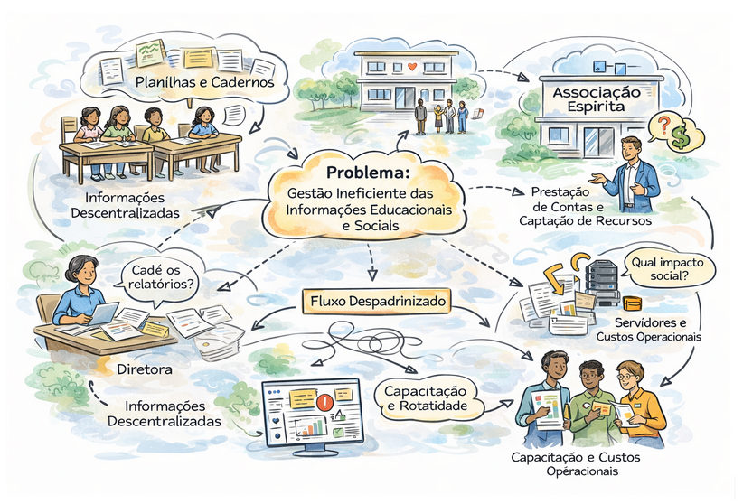

# Identificação e Contexto

## Identificação dos Clientes/Parceiros

* **Nome:** Sociedade Espírita Auta de Souza;
* **Tipo:** Instituição Social-Educacional.
* **Representante:** Jussara Cordeiro Limeira (Vice-presidente da Associação).
* **Forma de contato:** Reuniões Periódicas por videoconferência e canal de mensagens instantâneas.
* **Vínculo com o projeto:** Cliente real e umas das partes interessadas principais, pois representa o stakeholder (Presidência da instituição) e usuário final do sistema (Gestor do projeto sócio-educacional). Será um dos responsáveis por elicitar, validar requisitos e decisões do projeto, além de avaliar as entregas realizadas ao longo do desenvolvimento.

## Introdução ao Negócio e Contexto

A instituição cliente é uma organização de caráter social que atua no apoio a famílias em situação de vulnerabilidade, oferecendo cursos, oficinas e ações voltadas principalmente à promoção da saúde mental, bem-estar e assistência básica. Inserida no terceiro setor, sua atuação não possui fins lucrativos, sendo fortemente baseada no trabalho voluntário e no engajamento da comunidade. Ao longo de suas atividades, a instituição tem conseguido atender dezenas de famílias, promovendo não apenas suporte material, como doações, mas também desenvolvimento pessoal e social por meio de suas iniciativas.

O público-alvo da instituição é composto majoritariamente por pessoas em contextos de vulnerabilidade social, incluindo indivíduos que buscam apoio emocional, qualificação por meio de cursos e acompanhamento contínuo em atividades oferecidas. Além disso, a instituição também se relaciona com voluntários que atuam como instrutores e colaboradores, bem como com gestores responsáveis pela coordenação das ações e tomada de decisões estratégicas.

Apesar do impacto positivo gerado, a instituição ainda enfrenta desafios relacionados à organização e gestão das informações. Historicamente, o controle de dados tem sido realizado de forma manual e descentralizada, utilizando cadernos e planilhas individuais, o que dificulta o acompanhamento dos participantes, a análise de resultados e a geração de relatórios. Esse cenário limita a capacidade da instituição de monitorar o engajamento dos alunos, identificar evasões e demonstrar de forma estruturada o impacto social de suas ações.

## Rich Picture

