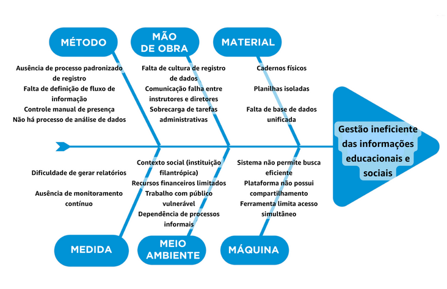

# Oportunidade e Desafios

## Identificação da Oportunidade ou Problema

Há um problema claro na forma como a instituição gerencia as informações relacionadas aos alunos e às atividades realizadas. Atualmente, não existe um sistema centralizado, o que faz com que os dados fiquem dispersos entre cadernos e planilhas individuais, dificultando o acompanhamento de frequência, evasão e histórico dos participantes, além de tornar a geração de relatórios um processo manual e sujeito a erros.

Além disso, a instituição ainda não utiliza uma abordagem orientada a dados, o que limita a análise estratégica e a identificação de indicadores relevantes. A descentralização dos processos, onde cada instrutor registra informações de forma independente, gera inconsistências, retrabalho e dificulta a consolidação dos dados.

Esse cenário é agravado pela dependência de trabalho voluntário e pela comunicação fragmentada entre instrutores e gestores, comprometendo a continuidade e a confiabilidade das informações. Como consequência, a instituição tem dificuldade em acompanhar seus alunos, fortalecer o relacionamento com eles e demonstrar de forma clara seu impacto social.

Dessa forma, evidencia-se a necessidade de uma solução que centralize, organize e torne acessíveis as informações, apoiando tanto a operação quanto a tomada de decisão.

## Desafios do Projeto

A partir do problema de **gestão ineficiente das informações educacionais e sociais**, o projeto apresenta desafios técnicos, organizacionais, de conhecimento e financeiros.

Do ponto de vista técnico, é necessário desenvolver uma solução simples e acessível, compatível com a realidade da instituição, que atualmente utiliza ferramentas básicas. Também devem ser consideradas possíveis limitações de infraestrutura, como acesso à internet e dispositivos.

No aspecto de conhecimento, há o desafio de garantir que voluntários consigam utilizar o sistema, exigindo uma interface intuitiva e possível capacitação, evitando resistência à adoção.

Operacionalmente, a falta de padronização e a descentralização dos processos dificultam a implementação da solução, exigindo mudanças na forma de registro e organização das informações.

Além disso, a dependência de voluntários e sua rotatividade impactam a continuidade do uso do sistema, tornando o engajamento dos usuários um fator crítico.

Por fim, há o desafio financeiro, já que a instituição possui recursos limitados, sendo necessário considerar custos operacionais como servidores e manutenção, buscando uma solução viável e sustentável.
