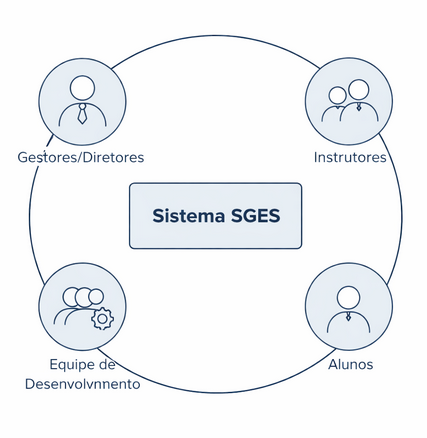

# Stakeholders

## Mapa de Stakeholders

**Vice-presidente:** Stakeholder central por ser a responsável pela mediação da plataforma. É o ponto de contato entre as decisões estratégicas, comunicação com desenvolvedores e a operação cotidiana, garantindo que a ferramenta atenda às necessidades de todos os perfis.

**Diretores:** São usuários finais da plataforma (acessam informações, gerenciam beneficiários) e, ao mesmo tempo, fornecem suporte nas decisões estratégicas sobre os programas. Contribuem com a vice-presidente para tratar de demandas da aplicação em caso de sua ausência.

**Professores:** Usuários do dia a dia da plataforma, responsáveis pelo registro de frequência, controle de faltas e gestão de matrículas dos beneficiários nas turmas. Reportam as informações operacionais, como frequência de alunos, que chegam até os diretores.

**Time de desenvolvimento:** Responsáveis por planejar, construir e entregar a solução. Seu trabalho precisa estar alinhado às necessidades identificadas junto aos demais stakeholders com a finalidade de mediar a solução para satisfazer todas as partes e resolver os problemas mapeado.

Abaixo é apresentado mais detalhes de quem serão os stakeholders que irão acompanhar, validar, elicitar e ajudar no processo de descoberta de novos requisitos durante o desenvolvimento do projeto.

A seguir, é apresentado um quadro resumo dos stakeholders.

| Stakeholders | Relação com a solução | Interesse principal | Influência |
| :---- | ----- | ----- | ----- |
| Vice-Presidente *(Rep: Jussara Cordeiro Limeira)* | Cliente real, usuário final e mediador. | Buscar oportunidades de gerir beneficiários da organização. | Alta |
| *Diretores* | Cliente real, usuário final e mediadores em caso de ausência da presidência | Suporte em tomadas de decisão, gerência de beneficiários da organização. | Média |
| *Professores* | Cliente real, usuário final da aplicação. | Controle dos beneficiários | Média |
| *Desenvolvedores (Rep: Gabriel M, Gabriel, Vinicius, Matheus, Medeiros, Guilherme)* | Desenvolvedores da solução, junto aos stakeholders, são responsáveis por mapear a solução e desenvolvê-la atendendo as necessidades de todas as partes. | Mapear as necessidades e desenvolver a solução | Alta |
