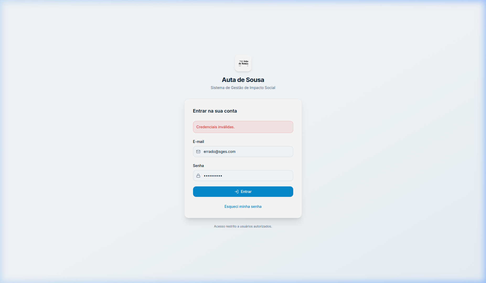
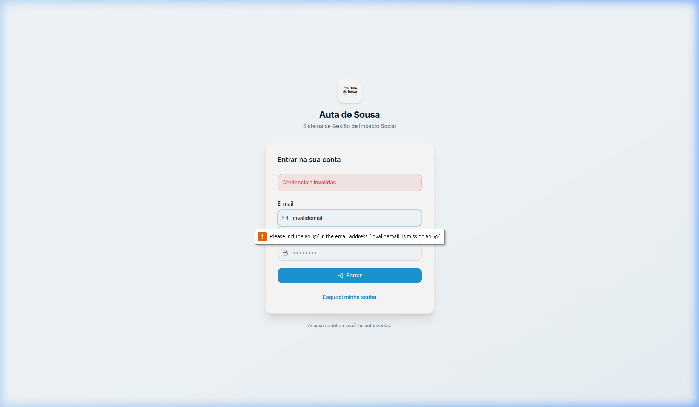
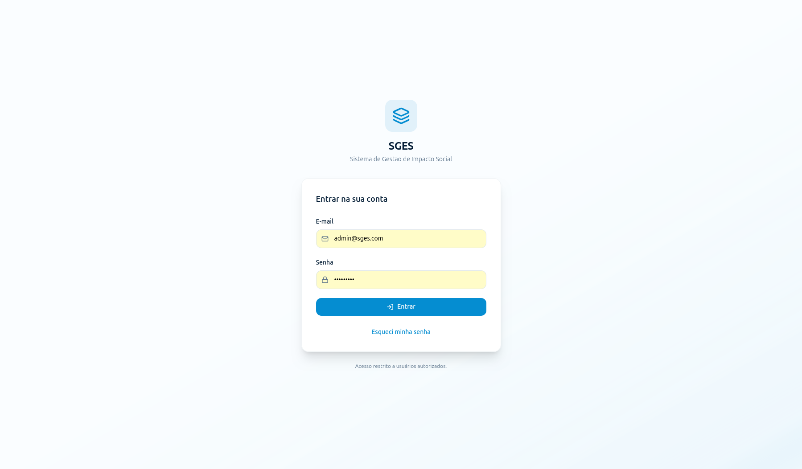

# SGES
## CSU01 (RF01) — Autenticar usuário

[Matriz de Priorização](../../matriz_de_acao_e_priorizacao.md)  
[Andamento](../andamento.md)  
[Cronograma e Planejamento](../../planejamento_organizacao/cronograma_e_entregas.md#tabela-de-cronograma-e-planejamento)

---

### Objetivo:
Validar as credenciais para o controle de acesso ao sistema.

### Ator principal:
Usuário (Qualquer perfil cadastrado)

### Atores secundários:
Nenhum

### Pré-condições:
O usuário deve possuir uma conta cadastrada e ativa no sistema.

### Fluxo principal:
1. O usuário acessa a página de login do SGES.
2. O sistema solicita o e-mail e a senha do usuário.
3. O usuário insere suas credenciais e confirma a operação.
4. O sistema valida as credenciais informadas no banco de dados. (RN01-01; FE-4-A; FE-4-B; FE-4-C; FE-4-D; FE-4-E; FE-4-F)
5. O sistema estabelece uma sessão de acesso segura.
6. O sistema redireciona o usuário para a página inicial (Dashboard) correspondente ao seu perfil de acesso.

### Fluxos alternativos:
Não há fluxos alternativos identificados.

### Fluxos de exceção:
#### FE-4-A — E-mail Inválido
Este fluxo inicia no passo 4 do fluxo principal. Se o e-mail informado estiver incorreto ou não constar na base de dados, o sistema exibe uma mensagem de erro indicando credenciais inválidas. O fluxo retorna ao passo 2 do fluxo principal.

{: style="border-radius: 8px; box-shadow: 0 4px 16px rgba(0,0,0,0.08); max-width: 100%; border: 1px solid var(--sges-card-border); margin-top: 1rem;"}

#### FE-4-B — Senha Inválida
Este fluxo inicia no passo 4 do fluxo principal. Se a senha informada estiver incorreta, o sistema exibe uma mensagem de erro indicando credenciais inválidas e solicita novas credenciais. O fluxo retorna ao passo 2 do fluxo principal.

{: style="border-radius: 8px; box-shadow: 0 4px 16px rgba(0,0,0,0.08); max-width: 100%; border: 1px solid var(--sges-card-border); margin-top: 1rem;"}

#### FE-4-C — Bloqueio de Conta
Este fluxo inicia no passo 4 do fluxo principal. Se o número de tentativas consecutivas falhas atingir 5, o sistema altera o status da conta para 'Bloqueada', registra a ocorrência na trilha de auditoria (segurança) e exibe uma mensagem informando que a conta foi temporariamente bloqueada por segurança.

#### FE-4-D — Dados Inválidos
Este fluxo inicia no passo 4 do fluxo principal. Se o e-mail estiver em formato inválido ou se os campos de credenciais estiverem vazios, o sistema impede a autenticação, exibe mensagens de erro de validação correspondentes e solicita a correção.

{: style="border-radius: 8px; box-shadow: 0 4px 16px rgba(0,0,0,0.08); max-width: 100%; border: 1px solid var(--sges-card-border); margin-top: 1rem;"}

#### FE-4-E — Permissão Insuficiente
Este fluxo inicia no passo 4 do fluxo principal. Se a conta do usuário estiver inativa ou se ele não possuir um perfil com permissões ativas e válidas para o sistema, o acesso é bloqueado e o sistema exibe uma mensagem de erro de permissão insuficiente.

#### FE-4-F — Falha de Persistência
Este fluxo inicia no passo 4 do fluxo principal. Se houver uma falha de conexão com a base de dados ou um erro interno no servidor, o sistema exibe uma mensagem informando a indisponibilidade momentânea do serviço e orienta a tentar novamente.

### Regras de negócio:
#### RN01-01 — Validação de Credenciais
O acesso só é concedido mediante a correspondência exata do e-mail cadastrado e da senha criptografada.

### Pós-condições:
O usuário obtém acesso às funcionalidades do sistema correspondentes ao seu perfil de acesso através de uma sessão ativa e segura.

#### Protótipo de Tela (DoR)

{: style="border-radius: 8px; box-shadow: 0 4px 16px rgba(0,0,0,0.08); max-width: 100%; border: 1px solid var(--sges-card-border); margin-top: 1rem;"}
