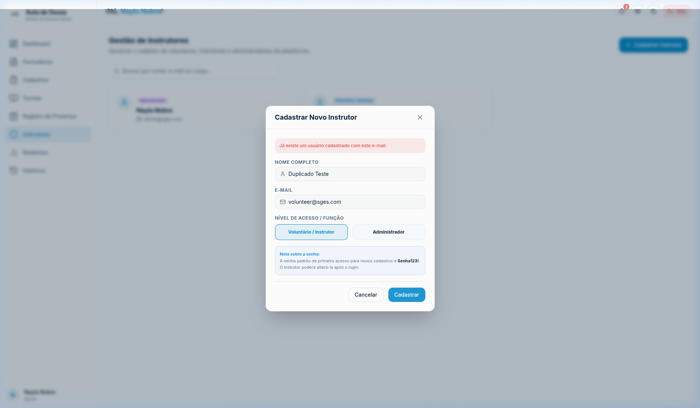

# SGES
## CSU04 (RF04) — Cadastrar instrutor

[Matriz de Priorização](../../matriz_de_acao_e_priorizacao.md)  
[Quadro MVP](../../planejamento_organizacao/quadro_mvp.md)  
[Cronograma e Planejamento](../../planejamento_organizacao/cronograma_e_entregas.md#tabela-de-cronograma-e-planejamento)

---

### Objetivo:
Permitir o cadastro de novos instrutores.

### Ator principal:
Gestor

### Atores secundários:
Nenhum

### Pré-condições:
O Gestor deve estar autenticado e possuir perfil de acesso administrador.

### Fluxo principal:
1. O Gestor acessa o painel de administração e solicita o cadastro de um novo instrutor. (FE-1-A)
2. O sistema exibe o formulário de cadastro solicitando: Nome Completo e E-mail.
3. O Gestor preenche as informações e seleciona o perfil de acesso apropriado. (RN04-02)
4. O Gestor confirma a operação.
5. O sistema valida a unicidade do E-mail, além de garantir o preenchimento de todos os dados obrigatórios. (RN04-01; RN04-02; FE-5-A; FE-5-B; FE-5-C)
6. O sistema salva o instrutor, envia à base de dados e gera o registro na trilha de auditoria. (RNF02; FE-6-A)
7. O sistema exibe uma mensagem confirmando o cadastro com sucesso.

### Fluxos alternativos:
Não há fluxos alternativos identificados.

### Fluxos de exceção:
#### FE-1-A — Permissão Insuficiente
Este fluxo inicia no passo 1 do fluxo principal. Se o usuário autenticado não possuir o perfil de Gestor/Administrador, o sistema bloqueia o acesso, impede a operação e exibe uma mensagem de acesso negado. O caso de uso é encerrado.

#### FE-5-A — Campos Obrigatórios Ausentes
Este fluxo inicia no passo 5 do fluxo principal. Se algum campo obrigatório estiver em branco, o sistema impede a gravação, exibe uma mensagem de alerta e destaca os campos que precisam ser preenchidos. O fluxo retorna ao passo 3 do fluxo principal.

#### FE-5-B — E-mail já Cadastrado
Este fluxo inicia no passo 5 do fluxo principal. Se o e-mail informado já constar na base de dados de outro instrutor, o sistema bloqueia a gravação e apresenta um alerta informando a duplicidade do e-mail. O fluxo retorna ao passo 3 do fluxo principal.

{: style="border-radius: 8px; box-shadow: 0 4px 16px rgba(0,0,0,0.08); max-width: 100%; border: 1px solid var(--sges-card-border); margin-top: 1rem;"}

#### FE-5-C — Dados Inválidos
Este fluxo inicia no passo 5 do fluxo principal. Se algum dado fornecido estiver em formato incorreto (ex: e-mail inválido), o sistema impede a gravação e solicita a correção. O fluxo retorna ao passo 3 do fluxo principal.

#### FE-6-A — Falha de Persistência
Este fluxo inicia no passo 6 do fluxo principal. Se ocorrer uma falha ao tentar salvar o instrutor no banco de dados, o sistema aborta a transação, exibe uma mensagem de erro e não altera o estado do sistema. O caso de uso é encerrado.

### Regras de negócio:
#### RN04-01 — Unicidade de E-mail
O e-mail do instrutor deve ser único na base de dados, impedindo duplicidades.

#### RN04-02 — Campos Obrigatórios
É obrigatório o preenchimento de Nome Completo e E-mail, além da definição do Perfil de Acesso (RBAC).

### Requisitos não funcionais:
#### RNF02 — Trilha de Auditoria
A criação de perfis de instrutor deve registrar um log automático contendo o ID do Gestor, ação realizada e timestamp.

### Pós-condições:
O novo instrutor é persistido na base de dados com um identificador exclusivo e o perfil de acesso adequado.
