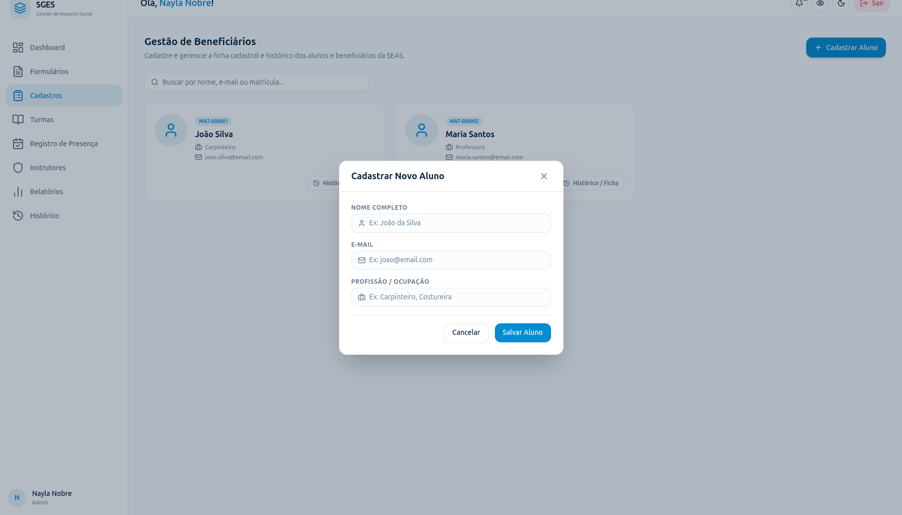

# SGES
## Especificação de Caso de Uso: CSU06 (RF07) - Cadastrar beneficiário

[Matriz de Priorização](../../matriz_de_acao_e_priorizacao.md)  
[Andamento](../andamento.md)  
[Cronograma e Planejamento](../../cronograma_e_entregas.md#tabela-de-cronograma-e-planejamento)

---

### 1. Breve Descrição
Registrar um novo beneficiário informando seus dados cadastrais e de contato.

---

### 2. Fluxo Básico de Eventos
1. O usuário acessa o menu de beneficiários e clica em 'Cadastrar Beneficiário'.
2. O sistema apresenta o formulário de cadastro solicitando os dados obrigatórios (Foto, Nome Completo, Telefone, E-mail, Endereço, Profissão, Contato de Emergência [Nome e Telefone]) e opcionais (CPF, Contato Responsável).
3. O usuário insere as informações requeridas e clica em 'Salvar'.
4. O sistema valida o formato dos dados preenchidos e a unicidade do CPF (se fornecido). [[FE-4-A](#fe-4-a-dados-obrigatorios-ausentes), [FE-4-B](#fe-4-b-formato-de-cpf-invalido), [FE-4-C](#fe-4-c-cpf-de-beneficiario-ja-cadastrado)]
5. O sistema armazena o cadastro com o status de beneficiário ativo e gera um identificador único (ID).
6. O sistema exibe uma mensagem de confirmação de cadastro bem-sucedido.

---

### 3. Fluxos Alternativos
Não há fluxos alternativos identificados.

---

### 4. Fluxos de Exceção
#### FE-4-A - Dados Obrigatórios Ausentes
No passo 4, se os dados obrigatórios não forem preenchidos, o sistema cancela a operação, indica os erros na tela e solicita a correção.

#### FE-4-B - Formato de CPF Inválido
No passo 4, se o CPF fornecido estiver no formato incorreto, o sistema cancela a operação, indica o erro de formatação na tela e solicita a correção.

#### FE-4-C - CPF de Beneficiário já Cadastrado
No passo 4, se o CPF digitado já estiver cadastrado para outro beneficiário, o sistema bloqueia o registro e apresenta um aviso informando a duplicidade.

---

### 5. Pré-Condições
* O usuário (Gestor ou Instrutor) deve estar autenticado no sistema.

---

### 6. Pós-Condições
* O beneficiário é adicionado de forma ativa ao cadastro de beneficiários do sistema, habilitando-o para matrícula em oficinas.

---

### 7. Pontos de Extensão
Nenhum ponto de extensão identificado.

---

### 8. Requisitos Especiais
* RNF01 - Criptografia Sensível: Os dados de identificação pessoal e sensível dos beneficiários devem ser hasheados ou criptografados na base de dados.
* Adequação às diretrizes da LGPD com relação à coleta de dados pessoais de menores.

---

### 9. Informações Adicionais

#### Protótipo de Tela (DoR)

{: style="border-radius: 8px; box-shadow: 0 4px 16px rgba(0,0,0,0.08); max-width: 100%; border: 1px solid var(--sges-card-border); margin-top: 1rem;"}
