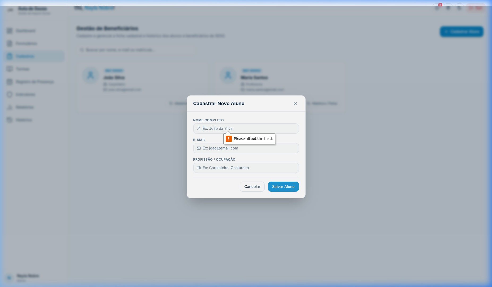

# SGES
## CSU06 (RF07) — Cadastrar beneficiário

[Matriz de Priorização](../../matriz_de_acao_e_priorizacao.md)  
[Andamento](../andamento.md)  
[Cronograma e Planejamento](../../planejamento_organizacao/cronograma_e_entregas.md#tabela-de-cronograma-e-planejamento)

---

### Objetivo:
Registrar um novo beneficiário informando seus dados cadastrais e de contato.

### Ator principal:
Gestor / Instrutor

### Atores secundários:
Nenhum

### Pré-condições:
O usuário (Gestor ou Instrutor) deve estar autenticado no sistema.

### Fluxo principal:
1. O usuário acessa o menu de beneficiários e solicita o cadastro de um novo beneficiário. (FE-1-A)
2. O sistema apresenta o formulário de cadastro solicitando: Nome Completo, E-mail e Profissão.
3. O usuário insere as informações requeridas e confirma a operação. (RN06-01)
4. O sistema valida o preenchimento dos dados obrigatórios e a unicidade/formato das informações. (RN06-01; FE-4-A; FE-4-B; FE-4-C)
5. O sistema armazena o cadastro com o status de beneficiário ativo de forma segura e gera um identificador único (ID). (RNF01; FE-5-A)
6. O sistema exibe uma mensagem de confirmação de cadastro bem-sucedido.

### Fluxos alternativos:
Não há fluxos alternativos identificados.

### Fluxos de exceção:
#### FE-1-A — Permissão Insuficiente
Este fluxo inicia no passo 1 do fluxo principal. Se o perfil do usuário logado não for autorizado a gerenciar beneficiários, o sistema bloqueia o acesso à tela e retorna mensagem de erro de permissão insuficiente. O caso de uso é encerrado.

#### FE-4-A — Dados Obrigatórios Ausentes
Este fluxo inicia no passo 4 do fluxo principal. Se o Nome Completo não for preenchido, o sistema cancela a operação, indica o erro na tela e solicita a correção. O fluxo retorna ao passo 3 do fluxo principal.

{: style="border-radius: 8px; box-shadow: 0 4px 16px rgba(0,0,0,0.08); max-width: 100%; border: 1px solid var(--sges-card-border); margin-top: 1rem;"}

#### FE-4-B — E-mail já Cadastrado
Este fluxo inicia no passo 4 do fluxo principal. Se o e-mail informado já estiver cadastrado para outro beneficiário, o sistema bloqueia o registro, exibe mensagem de duplicidade de e-mail e solicita a correção. O fluxo retorna ao passo 3 do fluxo principal.

#### FE-4-C — Dados Inválidos
Este fluxo inicia no passo 4 do fluxo principal. Se o formato do e-mail do beneficiário ou do responsável estiver inválido, o sistema impede a gravação, exibe erros específicos de formatação e solicita a correção. O fluxo retorna ao passo 3 do fluxo principal.

#### FE-5-A — Falha de Persistência
Este fluxo inicia no passo 5 do fluxo principal. Se ocorrer uma falha ao tentar salvar os dados no banco de dados, o sistema interrompe a transação e exibe um alerta de falha de conexão ou gravação. O caso de uso é encerrado.

### Regras de negócio:
#### RN06-01 — Dados Obrigatórios
É obrigatório o preenchimento de Nome Completo.

### Requisitos não funcionais:
#### RNF01 — Criptografia Sensível
Os dados do beneficiário devem ser armazenados de forma segura na base de dados em conformidade com as diretrizes da LGPD.

### Pós-condições:
O beneficiário é adicionado de forma ativa ao cadastro de beneficiários do sistema, habilitando-o para matrícula em turmas.
