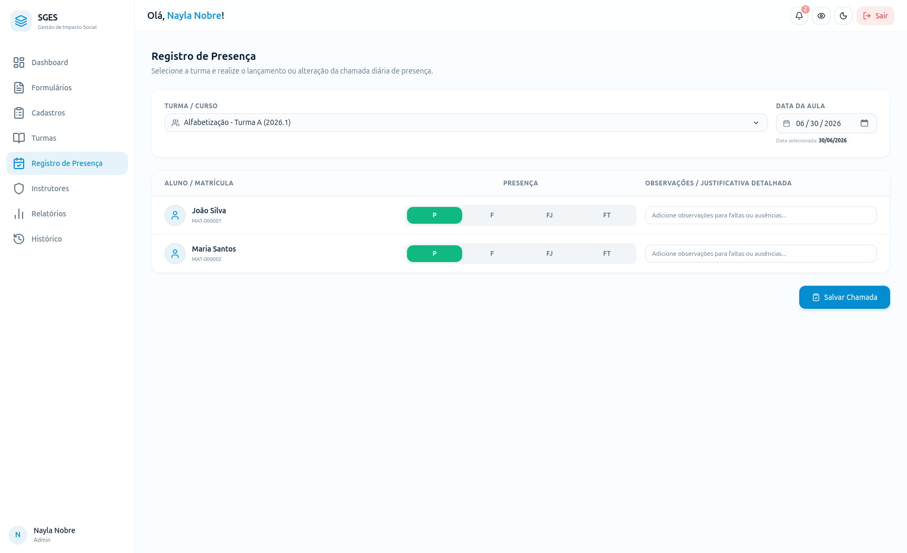

# SGES
## Especificação de Caso de Uso: CSU11 (RF13) - Registrar falta justificada

[Matriz de Priorização](../../matriz_de_acao_e_priorizacao.md)  
[Andamento](../andamento.md)  
[Cronograma e Planejamento](../../cronograma_e_entregas.md#tabela-de-cronograma-e-planejamento)

---

### 1. Breve Descrição
Lançar e registrar o abono de ausências de beneficiários no diário de classe mediante justificativas aceitas.

---

### 2. Fluxo Básico de Eventos
1. O Instrutor seleciona o beneficiário que faltou a uma aula específica.
2. O Instrutor seleciona a opção 'Registrar Justificativa de Falta'.
3. O sistema solicita o motivo da justificativa e a anexação de um comprovante (ex: atestado médico, declaração escolar).
4. O Instrutor preenche a justificativa, anexa o documento correspondente e clica em 'Salvar'.
5. O sistema altera o status da falta daquele dia de 'Não Justificada' para 'Justificada'.
6. O sistema armazena o anexo e exibe uma mensagem de confirmação de sucesso.

---

### 3. Fluxos Alternativos
Não há fluxos alternativos identificados.

---

### 4. Fluxos de Exceção
Não há fluxos de exceção identificados.

---

### 5. Pré-Condições
* O Instrutor está autenticado e o beneficiário possui uma falta registrada na data do abono.

---

### 6. Pós-Condições
* A falta do beneficiário é marcada como Justificada e não será contabilizada nos indicadores de risco de evasão.

---

### 7. Pontos de Extensão
Nenhum ponto de extensão identificado.

---

### 8. Requisitos Especiais
* Permitir o upload seguro de arquivos de comprovantes (formatos PDF, JPG, PNG) limitados a 5MB.

---

### 9. Informações Adicionais

#### Protótipo de Tela (DoR)

{: style="border-radius: 8px; box-shadow: 0 4px 16px rgba(0,0,0,0.08); max-width: 100%; border: 1px solid var(--sges-card-border); margin-top: 1rem;"}
