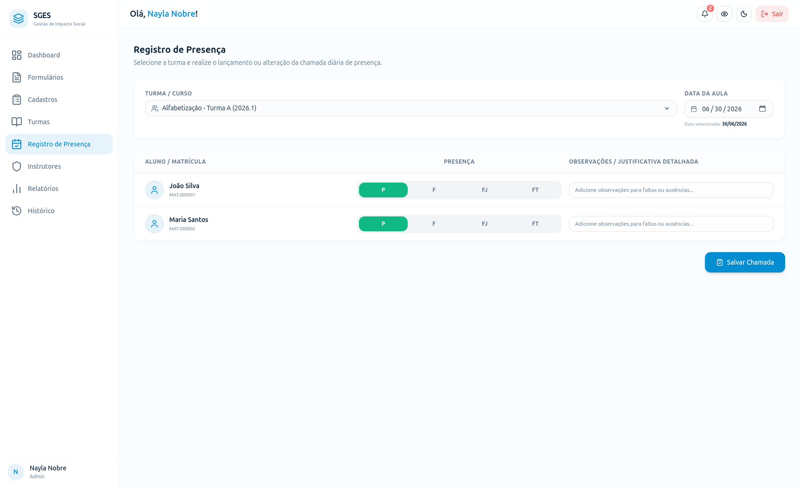
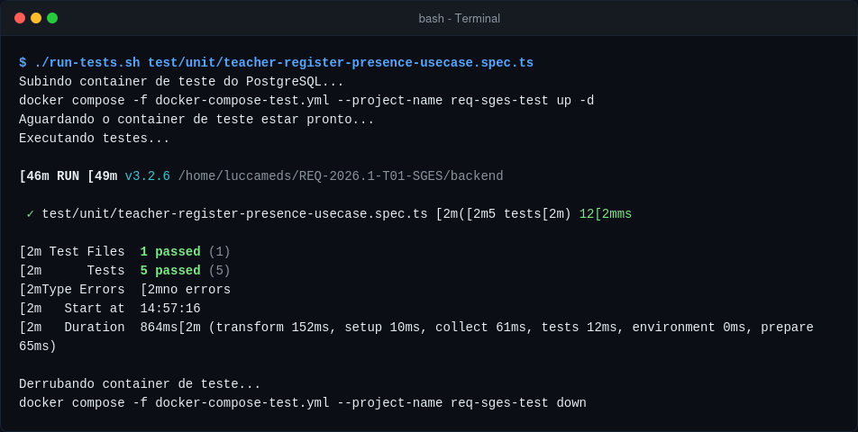

# SGES
## Checklist de DoR e DoD: CSU12 (RF11) - Registrar presença em lote

Este checklist serve como instrumento para guiar e validar a evolução deste caso de uso através do ciclo de desenvolvimento, em conformidade com o documento geral de [DoR e DoD](../../engenharia_requisitos.md) do projeto.

---

### 1. Definition of Ready (DoR)
Para que o requisito correspondente a este caso de uso seja considerado **Ready** (Pronto) e apto para entrar na sprint de desenvolvimento, todos os itens abaixo devem estar marcados:

- [x] **Caso de Uso:** O requisito está detalhado em sua especificação ([fluxo.md](fluxo.md))?
- [x] **Critérios de Aceitação:** Os critérios de aceitação foram descritos com clareza no arquivo de especificação do caso de uso e na lista de requisitos?
- [x] **Abstração:** O requisito está no mesmo grau de maturidade e detalhamento dos demais?
- [x] **Estimativa:** O requisito foi estimado pela equipe de desenvolvimento?
- [x] **Entrega de Valor:** O caso de uso agrega valor real ao negócio e está associado a um objetivo do projeto?
- [x] **Dependências Mapeadas:** Todas as dependências externas e internas foram identificadas e resolvidas?

#### Interface do Usuário (DoR)

{: style="border-radius: 8px; box-shadow: 0 4px 16px rgba(0,0,0,0.08); max-width: 100%; border: 1px solid var(--sges-card-border); margin-top: 1rem;"}

---

### 2. Definition of Done (DoD)
Para que este caso de uso seja considerado **Done** (Concluído) e sua entrega seja aceita, todas as condições abaixo devem ser atendidas e marcadas:

#### 2.1. Entrega de Valor
- [x] O trabalho realizado entrega um incremento funcional e observável no produto de software?
- [x] A entrega está devidamente rastreada e referenciada ao caso de uso `CSU12` no sistema de controle de versão (ex: nos commits/PRs)?

#### 2.2. Cobertura dos Requisitos
- [x] Todos os cenários descritos nos critérios de aceitação (fluxo básico, alternativos e exceções) foram implementados e testados?
- [x] O comportamento do sistema em situações normais e de falha foi validado?

#### 2.3. Qualidade de Testes
- [x] Foram implementados testes unitários para cobrir as regras de negócio deste caso de uso?
    * **Comando para execução dos testes:**
      ```bash
      # No diretório /backend:
      ./run-tests.sh test/unit/teacher-register-presence-usecase.spec.ts
      ```
    * **Evidência de Execução:**
      
- [x] Os fluxos principais foram validados manualmente em ambiente de testes pela equipe ou QA?

#### 2.4. Revisão por Pares (Code Review)
- [x] O Pull Request (PR) foi revisado e aprovado por pelo menos mais um integrante da equipe?
- [x] O código passou nas validações de conformidade de estilo, legibilidade, robustez lógica e de segurança (sem vazamento de credenciais ou dados sensíveis)?

#### 2.5. Documentação
- [x] A documentação técnica, de APIs (Swagger/OpenAPI) e este próprio repositório de requisitos foram atualizados com as alterações finais?
