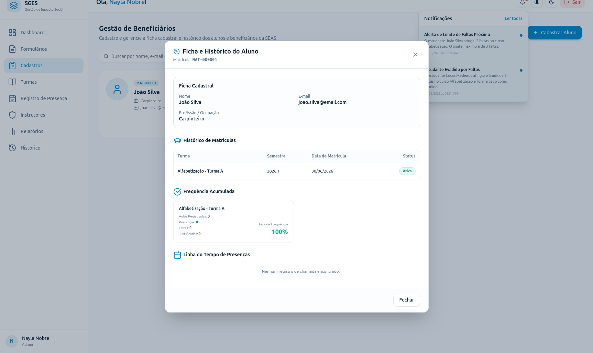

# SGES
## Especificação de Caso de Uso: CSU14 (RF15) - Consultar histórico do beneficiário

[Matriz de Priorização](../../matriz_de_acao_e_priorizacao.md)  
[Andamento](../andamento.md)  
[Cronograma e Planejamento](../../cronograma_e_entregas.md#tabela-de-cronograma-e-planejamento)

---

### 1. Breve Descrição
Visualizar a ficha cadastral do beneficiário com a linha do tempo consolidada contendo matrículas, frequência detalhada e histórico de alertas.

---

### 2. Fluxo Básico de Eventos
1. O usuário pesquisa um beneficiário por nome ou CPF no sistema.
2. O sistema apresenta a lista de beneficiários correspondentes à pesquisa. [[FE-2-A](#fe-2-a-beneficiario-nao-encontrado)]
3. O usuário seleciona o beneficiário correspondente.
4. O sistema consolida e exibe a ficha completa do beneficiário organizada em linha do tempo:
5.   - Relação de oficinas atuais e turmas concluídas.
6.   - Percentual global e mensal de presença.
7.   - Detalhamento de faltas, presenças e faltas justificadas.
8.   - Histórico de alertas de risco de evasão emitidos para o beneficiário.

---

### 3. Fluxos Alternativos
Não há fluxos alternativos identificados.

---

### 4. Fluxos de Exceção
#### FE-2-A - Beneficiário não Encontrado
No passo 2, se não existirem registros compatíveis com os termos pesquisados, o sistema exibe a mensagem 'Nenhum beneficiário encontrado com estes dados' e permite refazer a busca.

---

### 5. Pré-Condições
* O usuário deve estar autenticado no sistema.

---

### 6. Pós-Condições
* Os dados consolidados e a linha do tempo do beneficiário são apresentados de forma clara na tela do usuário.

---

### 7. Pontos de Extensão
Nenhum ponto de extensão identificado.

---

### 8. Requisitos Especiais
* Otimização de consultas ao banco de dados para consolidação rápida do histórico de presença.

---

### 9. Informações Adicionais

#### Protótipo de Tela (DoR)

{: style="border-radius: 8px; box-shadow: 0 4px 16px rgba(0,0,0,0.08); max-width: 100%; border: 1px solid var(--sges-card-border); margin-top: 1rem;"}
