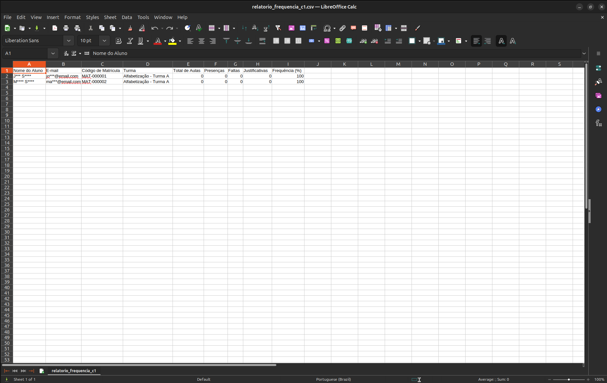
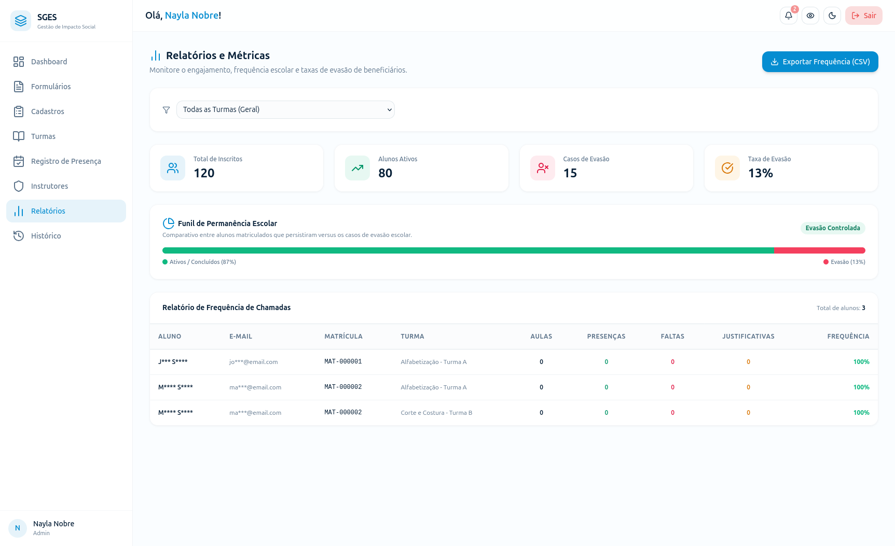

# SGES
## Especificação de Caso de Uso: CSU15 (RF16) - Gerar relatório de frequência

[Matriz de Priorização](../../matriz_de_acao_e_priorizacao.md)  
[Andamento](../andamento.md)  
[Cronograma e Planejamento](../../cronograma_e_entregas.md#tabela-de-cronograma-e-planejamento)

---

### 1. Breve Descrição
Exportar em formato CSV dados consolidados de presença e engajamento dos beneficiários segmentados por oficina, turma ou período, bem como gerar relatórios gráficos contendo as métricas de fluxo de ciclo dos alunos.

---

### 2. Fluxo Básico de Eventos
1. O Gestor acessa a seção de relatórios e seleciona a opção 'Relatório de Frequência'.
2. O Gestor escolhe os parâmetros de filtragem (ex: Oficina, Turma, Período Letivo).
3. O Gestor seleciona se deseja 'Gerar Relatório CSV' ou 'Visualizar Relatório de Ciclo'.
4. O sistema consulta os registros de frequência e matrículas com base nos filtros selecionados. [[FE-4-A](#fe-4-a-sem-registros-correspondentes)]
5. Se for exportação CSV, o sistema consolida e formata os dados em um arquivo de planilha eletrônica formatado em padrão CSV, e inicia automaticamente o download do arquivo gerado no navegador do usuário.
6. Se for relatório de ciclo, o sistema exibe gráficos com as métricas de fluxo de alunos: quantidade de alunos inscritos, quantidade de alunos desistentes e quantidade de alunos aprovados/concluintes.

---

### 3. Fluxos Alternativos
Não há fluxos alternativos identificados.

---

### 4. Fluxos de Exceção
#### FE-4-A - Sem Registros Correspondentes
No passo 4, se a consulta retornar vazia com os filtros aplicados, o sistema cancela a exportação do arquivo e exibe a mensagem 'Não existem dados de frequência correspondentes aos filtros selecionados'.

---

### 5. Pré-Condições
* O Gestor está autenticado e existem diários de chamadas gravados no período selecionado.

---

### 6. Pós-Condições
* Um arquivo CSV contendo os dados formatados e anonimizados/mascarados de frequência é baixado pelo usuário.

---

### 7. Pontos de Extensão
Nenhum ponto de extensão identificado.

---

### 8. Requisitos Especiais
* RNF03 - Mascaramento em Exportações: O sistema deve ofuscar ou mascarar dados pessoais sensíveis (como CPFs de beneficiários ou contatos) no arquivo final exportado.

---

### 9. Informações Adicionais

#### Protótipo de Tela (DoR)

{: style="border-radius: 8px; box-shadow: 0 4px 16px rgba(0,0,0,0.08); max-width: 100%; border: 1px solid var(--sges-card-border); margin-top: 1rem; margin-bottom: 1rem;"}

{: style="border-radius: 8px; box-shadow: 0 4px 16px rgba(0,0,0,0.08); max-width: 100%; border: 1px solid var(--sges-card-border); margin-top: 1rem;"}
