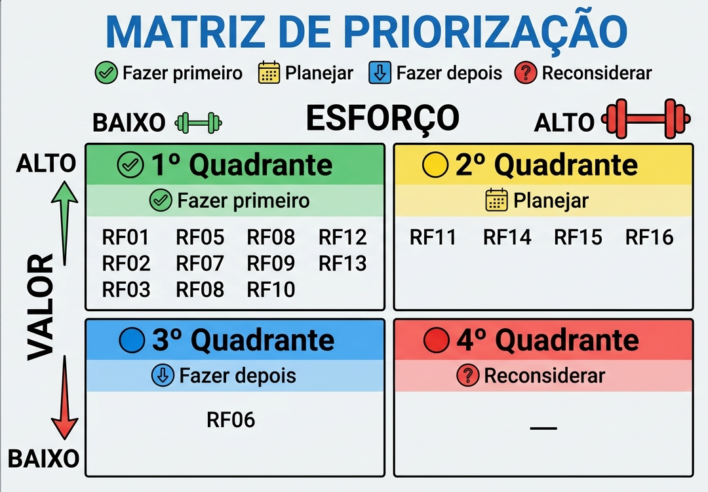

# Especificação de Histórias de Usuário e Requisitos (SGES)

Este documento apresenta o mapeamento completo dos Itens de Trabalho, estabelecendo a rastreabilidade direta entre as Características de Produto (Épicos), Histórias de Usuário (US), Critérios de Aceitação (CA), Requisitos Funcionais (RF) e Requisitos Não Funcionais (RNF).

---

## Tabela de Histórias de Usuário e Rastreabilidade

| Épico / Característica              | ID       | História de Usuário (User Story)                                                                                             | Critérios de Aceitação                                                                                                                                                                                                                             | Requisito Funcional                        | RNF Relacionados |
| :---------------------------------- | :------- | :--------------------------------------------------------------------------------------------------------------------------- | :------------------------------------------------------------------------------------------------------------------------------------------------------------------------------------------------------------------------------------------------- | :----------------------------------------- | :--------------- |
| **Segurança e Controle de Acessos** | **US01** | Como usuário do sistema, quero autenticar meu acesso para garantir que apenas pessoas autorizadas utilizem a plataforma.     | • **CA01-01:** Login válido gera token de acesso. • **CA01-02:** Após 5 tentativas inválidas, a conta é bloqueada e a tentativa é registrada no log de segurança.                                                                               | RF01 - Autenticar usuário                  | RNF10, RNF02     |
| **Segurança e Controle de Acessos** | **US02** | Como usuário, quero redefinir minha senha de forma segura para recuperar o acesso ao sistema quando necessário.              | • **CA02-01:** E-mail enviado em até 1 minuto. • **CA02-02:** Token de redefinição expira após 15 minutos. • **CA02-03:** Token expirado retorna erro no sistema.                                                                            | RF02 - Redefinir senha de acesso           | RNF01, RNF02     |
| **Segurança e Controle de Acessos** | **US03** | Como usuário, quero encerrar minha sessão para evitar acessos indevidos em dispositivos compartilhados.                      | • **CA03-01:** Token de sessão invalidado após o logout. • **CA03-02:** Requisições com credenciais antigas retornam erro de não autorizado (401).                                                                                              | RF03 - Encerrar sessão                     | RNF10            |
| **Gestão de Instrutores**           | **US04** | Como gestor, quero cadastrar instrutores para organizar e controlar quem pode atuar nas atividades da instituição.           | • **CA04-01:** Instrutor salvo com identificador único (ID). • **CA04-02:** Perfil de acesso definido com base em papéis (RBAC).                                                                                                                | RF04 - Cadastrar instrutor                 | RNF05, RNF11     |
| **Gestão de Instrutores**           | **US05** | Como gestor, quero editar o perfil dos instrutores para manter os dados e permissões atualizados.                            | • **CA05-01:** Alterações persistidas com sucesso no banco de dados. • **CA05-02:** Novas permissões refletidas imediatamente no acesso.                                                                                                        | RF05 - Editar perfil do instrutor          | RNF05, RNF02     |
| **Gestão de Instrutores**           | **US06** | Como gestor, quero inativar instrutores para revogar acessos sem perder o histórico dos dados.                               | • **CA06-01:** Status do usuário alterado para "inativo". • **CA06-02:** Autenticação bloqueada imediatamente para instrutores inativos.                                                                                                        | RF06 - Inativar instrutor                  | RNF02            |
| **Cadastro Sociodemográfico**       | **US07** | Como gestor ou instrutor, quero cadastrar beneficiários vinculados a famílias para organizar melhor o acompanhamento social. | • **CA07-01:** Beneficiário criado com sucesso no sistema. • **CA07-02:** Obrigatória a associação do beneficiário a um núcleo familiar válido.                                                                                                 | RF07 - Cadastrar beneficiário              | RNF01, RNF08     |
| **Cadastro Sociodemográfico**       | **US08** | Como gestor ou instrutor, quero editar os dados dos beneficiários para manter as informações atualizadas ao longo do tempo.  | • **CA08-01:** Alterações salvas com sucesso no banco de dados. • **CA08-02:** Dados atualizados exibidos corretamente na interface de usuário.                                                                                                 | RF08 - Editar dados do beneficiário        | RNF01, RNF08     |
| **Frequência e Engajamento**        | **US09** | Como gestor, quero cadastrar turmas com datas e vagas para organizar as atividades oferecidas pela instituição.              | • **CA09-01:** Turma criada com datas e horários válidos. • **CA09-02:** Limite máximo de vagas definido no cadastro. • **CA09-03:** Exibição correta da turma no catálogo institucional.                                                    | RF09 - Cadastrar Turma                     | RNF09, RNF11     |
| **Frequência e Engajamento**        | **US10** | Como gestor ou instrutor, quero matricular beneficiários em turmas para controlar a participação nas atividades.             | • **CA10-01:** Vínculo de matrícula criado com sucesso. • **CA10-02:** Sistema bloqueia novas matrículas caso o limite de vagas seja excedido.                                                                                                  | RF10 - Matricular beneficiário             | RNF09            |
| **Frequência e Engajamento**        | **US11** | Como instrutor, quero registrar presença em lote para agilizar o controle de frequência dos alunos.                          | • **CA11-01:** Registro de presença/falta salvo simultaneamente para todos os alunos da lista. • **CA11-02:** Lançamento permitido apenas na data em que a aula ocorre.                                                                         | RF11 - Registrar presença em lote          | RNF04, RNF05     |
| **Frequência e Engajamento**        | **US12** | Como gestor, quero alterar registros de frequência dentro de um prazo para corrigir possíveis erros.                         | • **CA12-01:** Alteração de registros permitida em até 72 horas após a aula. • **CA12-02:** Bloqueio automático de edições após o encerramento do prazo. • **CA12-03:** Obrigatoriedade de preenchimento de justificativa de alteração.      | RF12 - Alterar registro de frequência      | RNF02            |
| **Frequência e Engajamento**        | **US13** | Como instrutor, quero registrar faltas justificadas para garantir precisão nos dados de frequência.                          | • **CA13-01:** Status da falta registrado como "justificada". • **CA13-02:** Ausência justificada não contabiliza negativamente para os indicadores de evasão.                                                                                  | RF13 - Registrar falta justificada         | RNF02            |
| **Monitoramento de Evasão**         | **US14** | Como sistema, quero emitir alertas de evasão automaticamente para apoiar a identificação de alunos em risco.                 | • **CA14-01:** Identificação automática de 3 faltas consecutivas. • **CA14-02:** Identificação automática de 5 faltas alternadas dentro do período. • **CA14-03:** Alerta visual gerado e exibido nos painéis do sistema.                    | RF14 - Emitir alerta de evasão             | RNF06            |
| **Monitoramento de Evasão**         | **US15** | Como usuário, quero consultar o histórico do beneficiário para acompanhar sua participação e evolução.                       | • **CA15-01:** Exibição clara e consolidada de todas as presenças. • **CA15-02:** Histórico de alertas de risco emitidos. • **CA15-03:** Matrículas anteriores e atuais listadas em ordem cronológica.                                       | RF15 - Consultar histórico do beneficiário | RNF01, RNF02     |
| **Relatórios e Transparência**      | **US16** | Como gestor, quero gerar relatórios de frequência para apoiar a tomada de decisão e prestação de contas.                     | • **CA16-01:** Exportação de dados estruturada em formato CSV. • **CA16-02:** Dados do arquivo gerado correspondem estritamente aos filtros aplicados. • **CA16-03:** Colunas e delimitadores formatados adequadamente para leitura externa. | RF16 - Gerar relatório de frequência       | RNF03, RNF07     |

---

# Matriz de Ação e Priorização

Esta seção consolida a avaliação de todos os requisitos mapeados, cruzando o **Valor de Negócio** (Alto e Baixo) com o **Esforço Técnico** (Alto e Baixo) para determinar o quadrante de ação estratégico na esteira de desenvolvimento.

---

## 6.1 Métricas do Valor e Esforço

- **Valor (escala Likert 1 a 5):**
  - **Alto Valor:** Requisitos avaliados entre 4 e 5 pelo cliente.
  - **Baixo Valor:** Requisitos avaliados entre 1 e 3 pelo cliente.

- **Esforço Técnico:**
  - **Alto Esforço:** Tarefas que demandem mais de 12 horas para serem implementadas.
  - **Baixo Esforço:** Tarefas que demandem menos de 12 horas para serem implementadas.

---

## 6.2 Matriz de Priorização

### 1° Quadrante

- **Critérios:** Alto Valor, Baixo Esforço
- **Ação:** Fazer primeiro
- **Resultado:** Muito valor com pouco esforço

### 2° Quadrante

- **Critérios:** Alto Valor, Alto Esforço
- **Ação:** Planejar cuidadosamente
- **Resultado:** Importantes, consomem muitos recursos

### 3° Quadrante

- **Critérios:** Baixo Valor, Baixo Esforço
- **Ação:** Fazer quando houver tempo
- **Resultado:** Podem ser feitos entre tarefas maiores

### 4° Quadrante

- **Critérios:** Baixo Valor, Alto Esforço
- **Ação:** Reconsiderar
- **Resultado:** Muito esforço para pouco retorno

> Definimos como **MVP** todas as US relacionadas ao **1° quadrante**, mas pretendemos entregar também os do **2° quadrante**.

---

## 6.3 Priorização dos Itens de Trabalho e MVP

| US-ID | RF   | RNF Relacionado | Prioridade | Quadrante    | MVP |
| ----- | ---- | --------------- | ---------- | ------------ | --- |
| US01  | RF01 | RNF10, RNF02    | Must       | 1° Quadrante | X   |
| US02  | RF02 | RNF01, RNF02    | Must       | 1° Quadrante | X   |
| US03  | RF03 | RNF10           | Must       | 1° Quadrante | X   |
| US04  | RF04 | RNF05, RNF11    | Must       | 1° Quadrante | X   |
| US05  | RF05 | RNF05, RNF02    | Should     | 1° Quadrante | X   |
| US06  | RF06 | RNF02           | Could      | 3° Quadrante |     |
| US07  | RF07 | RNF01, RNF08    | Must       | 1° Quadrante | X   |
| US08  | RF08 | RNF01, RNF08    | Should     | 1° Quadrante | X   |
| US09  | RF09 | RNF09, RNF11    | Must       | 1° Quadrante | X   |
| US10  | RF10 | RNF09           | Must       | 1° Quadrante | X   |
| US11  | RF11 | RNF04, RNF05    | Must       | 2° Quadrante |     |
| US12  | RF12 | RNF02           | Should     | 1° Quadrante | X   |
| US13  | RF13 | RNF02           | Should     | 1° Quadrante | X   |
| US14  | RF14 | RNF06           | Must       | 2° Quadrante |     |
| US15  | RF15 | RNF01, RNF02    | Must       | 2° Quadrante |     |
| US16  | RF16 | RNF03, RNF07    | Must       | 2° Quadrante |     |
