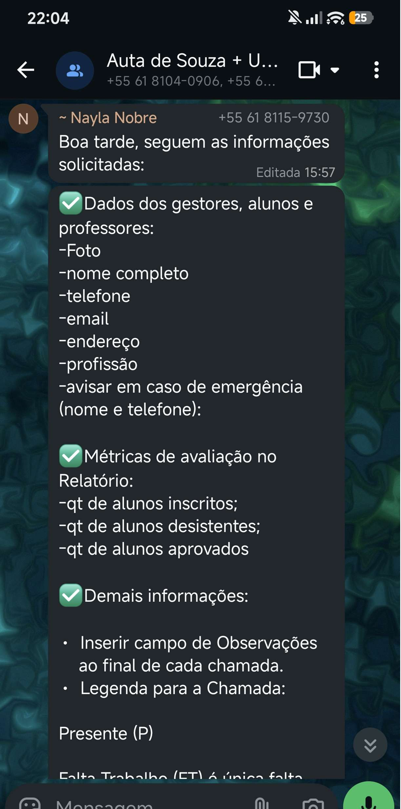

# **ATA DA REUNIÃO DE VALIDAÇÃO DE REQUISITOS – SISTEMA SGES**

>  **Rastreabilidade:** Esta reunião valida a etapa de **Elaboração** do projeto. Marco correspondente na [Tabela de Planejamento de Fases e Iterações](cronograma_e_entregas.md#tabela-de-planejamento-de-fases-e-iteracoes).

**Data:** 29 de maio de 2026  
**Local:** *Reunião Online*  
**Pauta Principal:** identidade visual e funcionalidades do SGES.

### **1\. PARTICIPANTES**

* **Gestores/Coordenadores:** *Nayla*  
* **Equipe de Desenvolvimento/Analistas:** *Gabriel Pereira, Guilherme, Vinícius, Gabriel Andrade*

### **2\. DELIBERAÇÕES E REQUISITOS DEFINIDOS**

#### **2.1. Perfis de Acesso e Permissões**

* **Perfil Coordenador/Gestor:** Terá acesso total a todas as funcionalidades do sistema, sendo o único perfil autorizado a **criar e excluir turmas**.  
* **Perfil Instrutor/Professor:** Terá permissão para realizar chamadas, incluir observações e **incluir/retirar alunos** de suas respectivas turmas.

#### **2.2. Cadastro de Usuários (Gestores, Alunos e Professores)**

Ficou definido que a ficha de cadastro padrão exigirá obrigatoriamente:

* Nome completo, Telefone, E-mail, Endereço e Profissão.  
* Foto de identificação.  
* Contato de emergência (Nome e Telefone).  
* profissão  
* atividades de semestres anteriores para os instrutores.

#### **2.3. Gestão de Turmas e Diário de Classe Digital**

* **Parâmetros da Turma:** Cada turma registrará o nome do curso, dupla de instrutores (limite de 2 por curso), livros estudados, dia/hora e limite inicial estimado em 50 vagas.  
* **Mapeamento de Frequência:** O professor realizará a chamada diretamente no sistema (com suporte a funcionamento *offline* em caso de queda de internet). Haverá um campo de **observações** ao final de cada chamada.  
* **Legenda e Regras de Chamada:**  
  * **P** (Presente)  
  * **FT** (Falta Trabalho): Única falta justificada que será **contabilizada como presença**.  
  * **F** (Falta)  
  * **D** (Desistência)  
* **Correção de Chamadas:** O professor terá um prazo regulamentar de até 72 horas (3 dias) para corrigir erros na chamada.

#### **2.4. Política de Alertas e Combate à Evasão**

* **Aviso de Falta:** Será disparado um e-mail automático para o aluno a **cada falta registrada**. O e-mail **não** deve ser enviado se o status do aluno for "Desistência (D)".  
* **Alerta de Evasão:** O sistema emitirá um alerta visual no painel (ícone/caixa de notificação) tanto para o instrutor quanto para a equipe de gestão caso o aluno atinja **2 faltas** (alerta de atenção) ou **3 faltas** (bloqueio/necessidade de refazer o curso).

#### **2.5. Inteligência, Relatórios e Recursos Extras**

* **Métricas do Relatório de Ciclo:** O sistema deve gerar relatórios visuais (gráficos) demonstrando o fluxo dos alunos: quantidade de inscritos, quantidade de desistentes e quantidade de aprovados/concluintes.  
* **Privacidade:** Os relatórios estratégicos devem omitir dados nominais dos alunos para preservar sua privacidade e segurança.  
* **Comunicação em Massa:** O sistema permitirá a extração de uma lista consolidada com todos os e-mails dos alunos para fins de divulgações institucionais pontuais.

#### **2.6. Identidade Visual**

* A interface gráfica do sistema utilizará uma paleta de cores composta por **Azul, Azul Claro e Branco**.  
* As telas devem ser limpas, transmitindo sensações de paz e calma, além de garantir usabilidade simples para usuários com pouca familiaridade com computadores.

### **3\. Validação e Aceite dos Requisitos**
*Após a apresentação da especificação de requisitos a coordenadora Nayla homologou e validou formalmente autorizando o início do desenvolvimento técnico correspondente à fase de Construção.*

### **Imagem dos dados solicitados durante a reunião para a comprovação da reunião**
{width="300px"}
